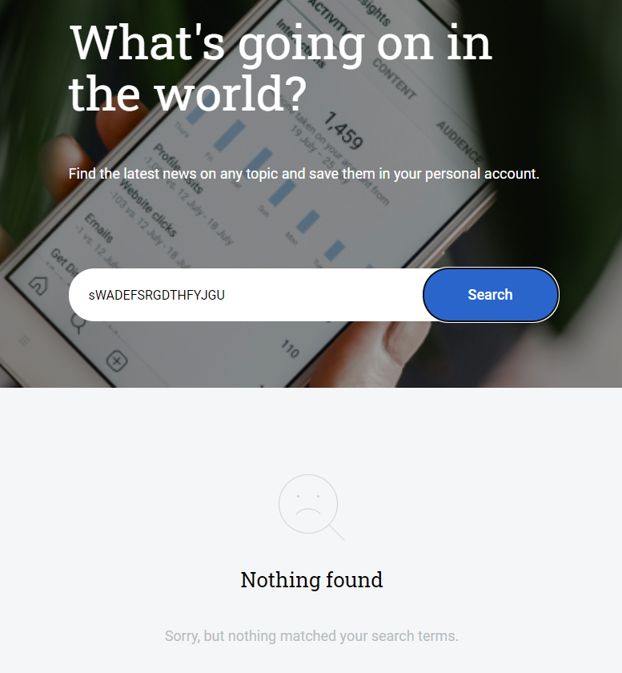
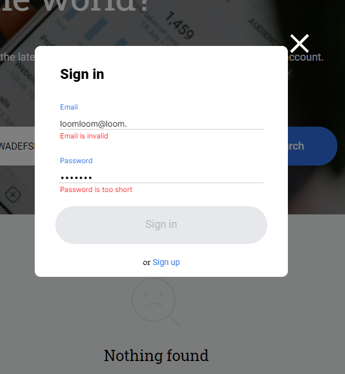
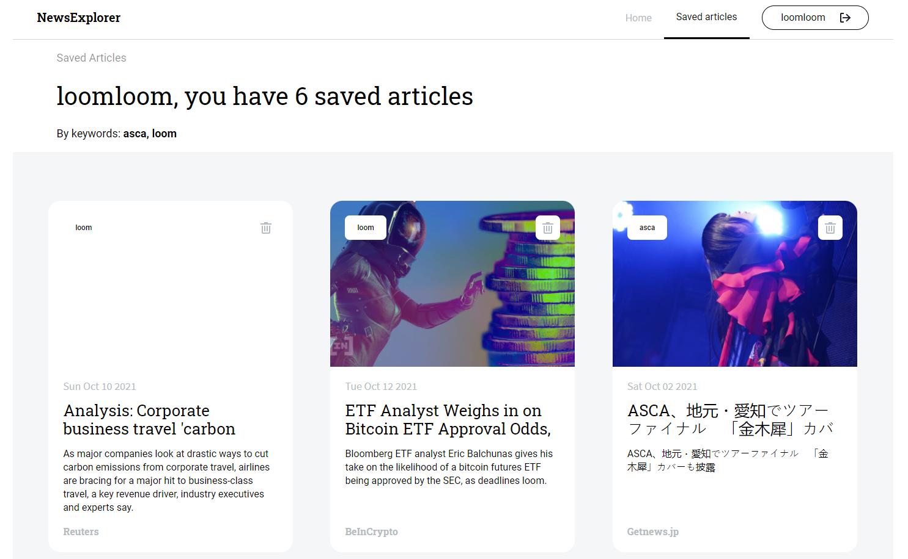
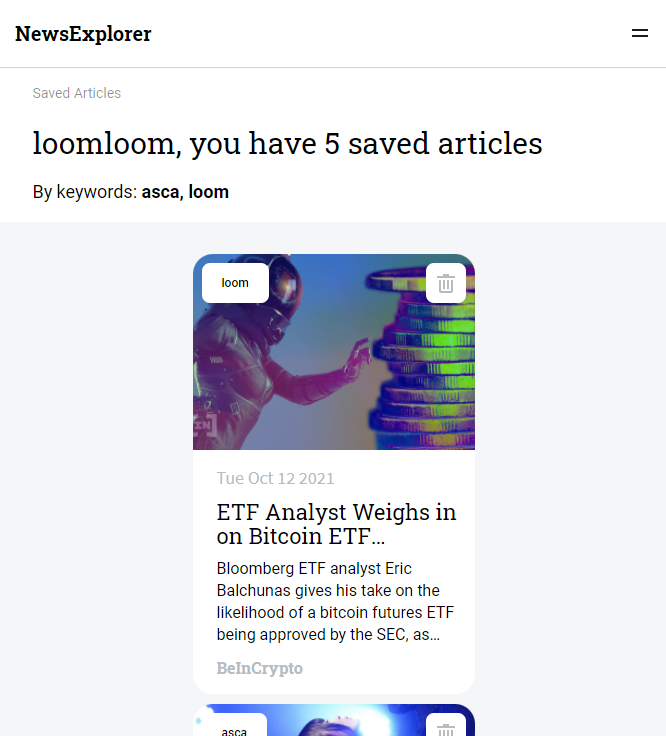

# KethNews Explorer

My site now retrieves a user's stored cards, allows them to delete them, and to search for more

form validation is employed for form inputs

=======
### Intro

News Explorer Frontend project on React, featuring authorization and registration.

This repository contains my front-end project on React with authorization and registration features.
All authorization, registration and token requests go through to my RESTful api: https://github.com/Kethiannne/news-explorer-api

### Functionality

  - The main purpose of this project was to simulate the production of a MERN stack project using pull requests and review.
  - User data is stored on the API, while a JWT sent to the user's local storage authenticates them on subsequent visits.
  - A third party News Search api (https://newsapi.org/) was integrated to allow users to search the web for articles
  - Clicking the bookmark button of a card will prompt a user to log in, or if already logged in will save it to a separate page, changing its appearance as it does so. If the article is already saved then clicking this button deletes it from your saved list.
  - Media queries make the site responsive to popular device types and layouts.
  - While signed in, users can access a page with their information and a list of their saved cards. The bookmark button is replaced here with a delete button.
  - The search terms a user uses to find a given article is saved to it as a keyword when the user saves it. These Keywords are displayed on the cards when viewed on the user's saved page.
  - when improper search terms are entered or when an error occurs in displaying the results, the user is informed via a message in the cards section

### Technologies
  - React JS
  - React Router DOM
  - Hosting via Google Cloud

### Live Version

https://kethianne-news.students.nomoreparties.site/

### Loom Demo

https://www.loom.com/share/94454444d06f4d76a47e63b74dd4df6a

### Future Improvements
  - Adding a dark mode option to the site for night time viewing
  - Adding a link functionality to cards so the original pages may be easily visited.

### images

>>>>>>> main
